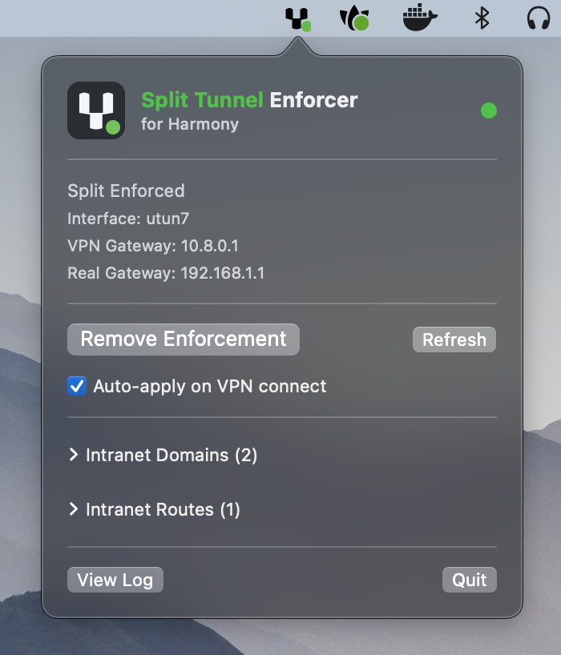

<p align="center">
  
</p>

<p align="center">
  A native macOS menubar app that enforces split tunneling for Harmony SASE (formerly Perimeter 81 / Check Point) VPN.
</p>

<p align="center">
  
</p>

## Problem

Harmony SASE supports split tunneling as an admin-configurable policy, but when the policy is set to full tunnel, all traffic routes through the VPN — including personal browsing, streaming, and non-corporate services. There is no client-side option to override this.

## What It Does

Removes the VPN's catch-all routes (`0.0.0.0/1` and `128.0.0.0/1`), keeping only intranet-bound traffic on the VPN tunnel. Internet traffic flows through your normal gateway.

When enforcing:

1. **Adds intranet routes** via the VPN interface (before touching catch-all routes — zero gap)
2. **Resolves intranet domain IPs** via the VPN's DNS server and adds host routes
3. **Deletes catch-all routes** (`0/1` and `128.0/1`) from the VPN interface
4. **Creates `/etc/resolver/` files** so DNS queries for intranet domains still go through VPN DNS
5. **Installs `pf` firewall rules** that block intranet traffic from leaking out the real interface

On first run, a one-time admin prompt installs a passwordless `sudoers` rule for `route`, `pfctl`, and resolver file management. All subsequent operations run without prompts.

## Requirements

- macOS 13+ (Ventura or later)
- Harmony SASE / Perimeter 81 VPN client
- Swift 5.9+ (only for building from source)

## Install

**Homebrew:**

```sh
brew install 4O4/tap/split-tunnel-enforcer
```

**Manual:** Download the latest DMG from [Releases](../../releases).

**From source:**

```sh
./bundle.sh                        # builds + creates .app bundle
open "Harmony Split Tunnel Enforcer.app"
```

## Usage

The app lives in the menubar. The fork icon indicates VPN state via a colored status dot:

| Dot | Meaning |
|-----|---------|
| 🔴 | VPN disconnected |
| 🟡 | Full tunnel detected — not yet enforced |
| 🟢 | Split tunnel enforced |

Left-click opens a popover with status and controls. Right-click opens a quick-action menu.

## Configuration

Create a JSON config file at one of these locations (first match wins):

1. `~/.config/harmony-split-tunnel/config.json`
2. `~/.harmony-split-tunnel.json`
3. `/etc/harmony-split-tunnel/config.json`

```json
{
  "intranetDomains": ["internal.corp.example.com", "wiki.example.com"],
  "intranetRoutes": ["10.0.0.0/8"],
  "autoApply": true
}
```

Domains and routes can also be edited in the popover UI. Changes persist in UserDefaults and take priority over the config file on subsequent launches.

## How It Works

- **VPN Detection** — Parses `netstat -rnf inet` every 4s, looking for `utun` interfaces with catch-all routes
- **Route Monitoring** — Runs `route -n monitor` in the background; when catch-all routes reappear (VPN reconnect), triggers auto-enforcement
- **Zero-Gap Enforcement** — Intranet routes are added *before* catch-all routes are deleted
- **pf Firewall** — Rules under `com.apple/p81split` anchor block intranet traffic from leaking via the real interface
- **DNS** — Per-domain `/etc/resolver/` files direct macOS to use VPN DNS for intranet lookups

## Log

Operations are logged to `/tmp/harmony-split-tunnel-enforcer.log`, accessible via "View Log" in the app.

## License

MIT
